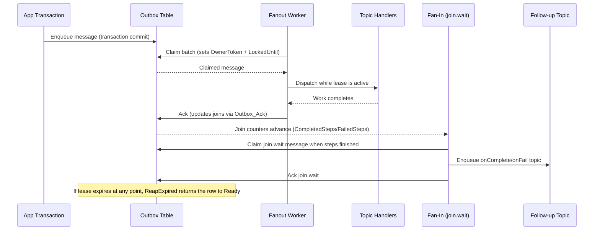

# Platform Primitives: Inbox, Outbox, Fanout, and Fan-In

This overview connects the platform's messaging primitives end-to-end. It explains how inbox and outbox tables participate in claim/ack/abandon semantics, how fanout builds on them to distribute work, and how fan-in (joins) consolidate results. Use this as a mental map before diving into API or schema reference pages.

## Core Roles at a Glance
- **Outbox**: Reliable, retryable publisher that turns transactional writes into background work. Implements claim → handler → ack/abandon/fail with automatic lease expiry.
- **Inbox**: Idempotent consumer guard that records messages already processed. Uses the same claim/ack/abandon lifecycle to protect handler execution.
- **Fanout**: Distributes outbox messages to multiple destinations or tenants while preserving the same leases and retries.
- **Fan-In (Join)**: Waits for multiple outbox messages to finish, then triggers a follow-up action once the group completes.

## Database Tables

### Outbox and Inbox Work Queues
- `Outbox`: Stores outbound messages with work-queue columns (`Status`, `LockedUntil`, `OwnerToken`, retry counts) plus payload metadata (`Topic`, `Payload`, correlation/causation IDs, timestamps).
- `Inbox`: Stores inbound message receipts with identical work-queue columns plus source identifiers (`MessageId`, `Source`, optional content hash) to guarantee at-most-once processing.
- Stored procedures for both queues follow the same shape: `Claim`, `Ack`, `Abandon`, `Fail`, and `ReapExpired` (lease expiry recovery).

### Fanout Metadata
- `FanoutPolicy`: Defines routing rules (topics to downstream destinations or tenant scopes).
- `FanoutCursor`: Tracks per-policy progress so handlers resume from the last dispatched outbox message after restarts.

### Fan-In (Join) Tables
- `OutboxJoin`: Declares a group of related outbox messages and tracks completion/failed counts.
- `OutboxJoinMember`: Associates individual outbox messages with a join so completion reporting happens automatically inside `Outbox_Ack`/`Outbox_Fail`.

## Claim/Ack/Abandon/Lease Expiry Across Components
1. **Claim**: Workers call `*_Claim` (outbox or inbox) to atomically move items from `Ready` to `InProgress`, set `OwnerToken`, and apply a lease by setting `LockedUntil = now + leaseSeconds`.
2. **Handler Execution**: While the lease is active, the worker dispatches to the appropriate handler(s) and downstream actions (fanout) or dedupes inbound work (inbox).
3. **Acknowledge**: On success, `*_Ack` clears the lease, marks the row as `Done`, and — for fan-in — updates `OutboxJoin` counters for any attached members.
4. **Abandon / Retry**: Temporary failures call `*_Abandon`, returning the item to `Ready` so another worker can claim it after backoff.
5. **Lease Expiry**: If a worker crashes, `*_ReapExpired` resets `InProgress` rows whose `LockedUntil` is in the past, making them claimable again.
6. **Permanent Failures**: `*_Fail` marks the item as failed and records diagnostics; fan-in joins receive failure counts from this path.

The same lifecycle underpins fanout and fan-in: fanout dispatchers claim outbox messages with leases; fan-in waits are themselves outbox messages that claim and ack like any other handler-controlled work item.

## Sequence: Fanout to Fan-In


## Sequence: Multi-Tenant Fanout Routing
```mermaid
sequenceDiagram
    participant Producer as Producer Code
    participant Router as IOutboxRouter
    participant TenantDB as Tenant Outbox Table
    participant Selector as Outbox Selection Strategy
    participant Dispatcher as MultiOutboxDispatcher
    participant Handler as Shared Handlers

    Producer->>Router: GetOutbox(tenantId)
    Router->>TenantDB: Enqueue message in tenant-specific Outbox
    loop Background polling
        Selector->>Dispatcher: Next tenant store (round-robin/drain-first)
        Dispatcher->>TenantDB: Claim messages (lease)
        TenantDB-->>Dispatcher: Claimed batch
        Dispatcher->>Handler: Invoke handler per Topic
        Handler-->>Dispatcher: Ack/Abandon/Fail decision
        Dispatcher->>TenantDB: Ack or Abandon; ReapExpired handles crashes
    end
```

## When to Use Each Primitive
- **Use the Outbox** when you need reliable, retryable publication of domain events or commands.
- **Use the Inbox** when consuming external events that might be delivered multiple times.
- **Add Fanout** when a single outbox stream must drive multiple destinations or tenants; policies and cursors keep routing deterministic and resumable.
- **Add Fan-In** when downstream steps must wait for a group of outbox messages to finish before continuing.

## Related Guides
- [Outbox Pattern Quick Start](outbox-quickstart.md)
- [Inbox Pattern Quick Start](inbox-quickstart.md)
- [Outbox Join / Fan-In Support](OUTBOX_JOIN_FANIN.md)
- [Understanding fanout and the outbox](official/fanout.md)
- [Outbox Router Guide](OutboxRouter.md)
